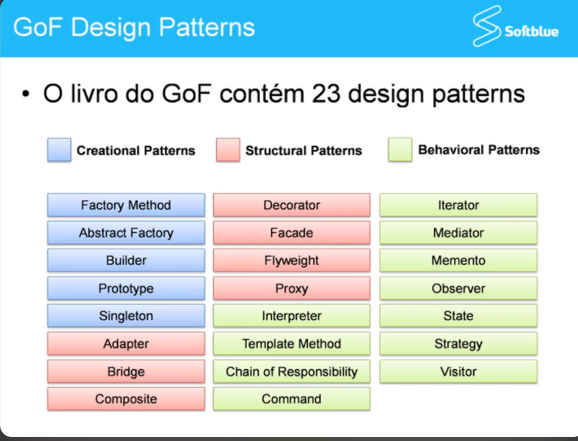

# Java design patterns
-  “Each pattern describes a problem which occurs over and over again in our
   environment, and then describes the core of the solution to that problem, in such a way that you can use this
   solution a million times over, without ever doing it the same way twice.”
   ― Christopher Alexander
       
  Tradução livre:
     “Cada padrão descreve um problema que ocorre repetidas vezes em nosso
  ambiente e, em seguida, descreve o núcleo da solução para esse problema, de forma que você possa usar isso
  solução um milhão de vezes, sem nunca fazê-lo da mesma maneira duas vezes.”
  ― Christopher Alexander

##### BENEFÍCIOS DOS DESIGN PATTERNS
- Auxiliam no desenvolvimento, pois o: 
  - Problema e solução já conhecidos
- Estabelece uma linguagem comun,pois:
  - Isto ajuda quando desenvolvedores precisam
  dar manutenção em softwares criados por
  por outras pessoas.

##### O QUE DESIGN PATTERNS NÃO SÃO
- Dependentes de uma linguagem de programação específica
- Solução pronta e implementada

##### UM DESIGN PATTER É DEFINIDO ATRAVÉS DOS SEGUINTES ELEMENTOS:

NOME -> para poder conversar a respeito, com a equipe e realizar
pesquisas, ou seja, seguir a termologia padrão reconhecida no mercado,
para que assim todo mundo falem a mesma língua;

PROBLEMA -> Descrição do problema que patter irá resolver.
SOLUÇÃO -> Qual a solução encontarda? aqui normalmente fica a descrição tecnica, ou seja,
quais saõ as classes envolvidas, como os elementos se comunicam, como os designer patter irá
funcionar.

CONSEQUÊNCIAS -> E quais as consequências que podem vim com a aplicação do designer patter,
tanto boas, quanto ruins.

- **Creational Patterns** - Padrões para criação de objetos
- **Structural Patterns** - Padrões de estrutura, que define como iremos compor/construir/modelar as classes e objetos
- **Behavioral Patterns** - Padrões de comportamento, como as clases e os objetos dividem as responsabilidade
e como os objetos ou classes se comunicam

Acesse as branches para visualizar a diferença entre os designer patterns

