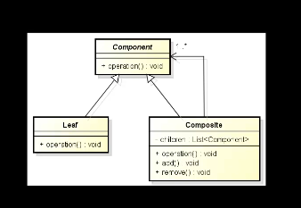
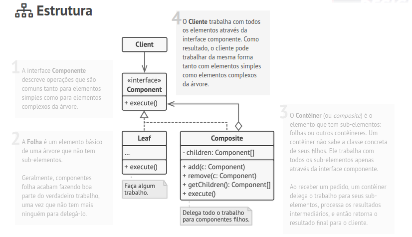
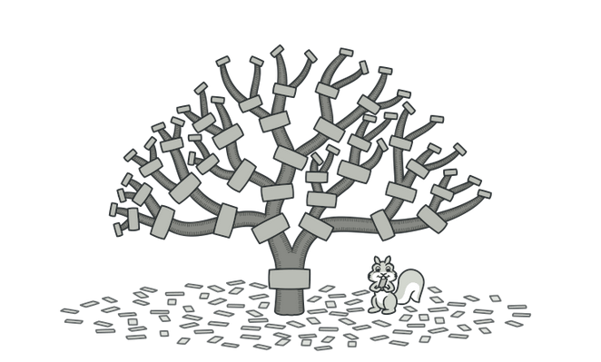
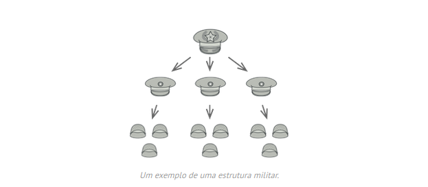

# Design Patter Composite
Também conhecido como: Árvore de objetos, Object tree

## Estrutura

1. Component - A interface Componente descreve operações que são comuns tanto
   para elementos simples como para elementos complexos da árvore. 
  (Super class(pai), que pode ser uma class abstrata ou uma interface)

2. Leaf - A Folha é um elemento básico de uma árvore que não tem sub-elementos(filhos).
   Geralmente, componentes folha acabam fazendo boa parte do verdadeiro
   trabalho, uma vez que não tem mais ninguém para delegá-lo.

3. O Contêiner (ou composite) é o elemento que tem sub-elementos:
    Agrupador de elementos folhas ou outros contêineres. Um contêiner não sabe a classe concreta
   de seus filhos. Ele trabalha com todos os sub-elementos apenas através
   da interface componente.

Ao receber um pedido, um contêiner delega o trabalho para seus
sub-elementos, processa os resultados intermediários, e então retorna
o resultado final para o cliente.

4. O Cliente trabalha com todos os elementos através da interface componente. Como resultado, o cliente pode trabalhar da mesma forma tanto com elementos simples como elementos complexos da árvore.

## Propósito

O Composite é um padrão de projeto estrutural que permite que você
componha objetos em estruturas de árvores e então trabalhe com 
essas estruturas como se elas fossem objetos individuais.

## Problema

Usar o padrão Composite faz sentido apenas quando o modelo central de
sua aplicação pode ser representada como uma árvore.

Por exemplo, imagine que você tem dois tipos de objetos: Produtos
e Caixas. Uma Caixa pode conter diversos Produtos bem como um número
de Caixas menores. Essas Caixas menores também podem ter alguns 
Produtos ou até mesmo Caixas menores que elas, e assim em diante.

Digamos que você decida criar um sistema de pedidos que usa essas classes. Os pedidos podem conter produtos simples sem qualquer compartimento, bem como caixas recheadas com produtos... e outras caixas. Como você faria para determinar o preço total desse pedido?

Um pedido pode envolver vários produtos, embalados em caixas, que são embalados em caixas maiores e assim em diante. Toda a estrutura se parece com uma árvore de cabeça para baixo.

Você pode tentar uma solução direta: desempacotar todas as caixas, 
verificar cada produto e então calcular o total. Isso pode ser 
viável no mundo real; mas em um programa, não é tão simples como 
executar uma iteração. Você tem que conhecer as classes dos Produtos
e Caixas que você está examinando, o nível de aninhamento das caixas
e outros detalhes cabeludos de antemão. Tudo isso torna uma solução 
direta muito confusa ou até impossível.

## Solução

O padrão Composite sugere que você trabalhe com Produtos e Caixas
através de uma interface comum que declara um método para a contagem
do preço total.

Como esse método funcionaria? Para um produto, ele simplesmente 
retornaria o preço dele. Para uma caixa, ele teria que ver cada 
item que ela contém, perguntar seu preço e então retornar o total 
para essa caixa. Se um desses itens for uma caixa menor, aquela caixa
também deve verificar seu conteúdo e assim em diante, até que o preço
de todos os componentes internos sejam calculados. Uma caixa pode até
adicionar um custo extra para o preço final, como um preço de embalagem.

O padrão Composite permite que você rode um comportamento recursivamente sobre todos os componentes de uma árvore de objetos.

O maior benefício dessa abordagem é que você não precisa se preocupar
sobre as classes concretas dos objetos que compõem essa árvore. Você 
não precisa saber se um objeto é um produto simples ou uma caixa 
sofisticada. Você pode tratar todos eles com a mesma interface. 
Quando você chama um método os próprios objetos passam o pedido pela 
árvore.

## Analogia com o mundo real

Um exemplo de uma estrutura militar.

Exércitos da maioria dos países estão estruturados como hierarquias. 
Um exército consiste de diversas divisões; uma divisão é um conjunto
de brigadas, e uma brigada consiste de pelotões, que podem ser divididos 
em esquadrões. Finalmente, um esquadrão é um pequeno grupo de soldados 
reais. Ordens são dadas do topo da hierarquia e são passadas abaixo para
cada nível até cada soldado saber o que

Referência: https://refactoring.guru/pt-br/design-patterns/composite
