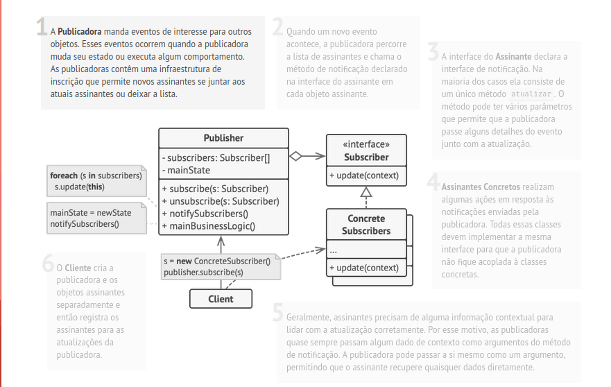

# Design Patter Observer
Também conhecido como: Observador, Assinante do evento, Event-Subscriber, Escutador, Listener

O padrão Observer (ou Padrão Observador) é um padrão de projeto de software comportamental que 
define uma dependência um-para-muitos entre objetos, de modo que quando um objeto 
muda de estado, todos os seus dependentes são notificados e atualizados automaticamente.
O padrão Observer é amplamente usado em sistemas onde uma mudança em um objeto requer a
alteração em outros objetos, como sistemas de eventos e sistemas baseados em 
GUI (interface gráfica do usuário).

Componentes do Padrão Observer:

- Subject (Sujeito): Este é o objeto que é **observado**. Ele mantém uma lista de observadores e 
fornece métodos para adicionar, remover e notificar observadores quando seu estado é alterado.

- Observer (Observador): São os objetos que **desejam receber notificações sobre as mudanças(Observador)** de 
estado do Subject. Eles implementam uma interface (geralmente chamada Observer) que define um método
de notificação(update). Quando o Subject muda, ele notifica todos os seus Observers chamando esse método.

- Concrete Subject (Objeto do Sujeito) é uma classe específica que implementa a interface Subject.
Ela mantém uma lista de Observers e notifica esses Observers quando seu estado muda.

- Concrete Observer (Objeto do Observador) são classes específicas que implementam a interface Observer. 
Cada um tem seu próprio comportamento personalizado que é executado quando ele é notificado pelo 
Concrete Subject.

O Subject ou Observer normalmente, são implementados como uma class abstrata ou interface no java

### Exemplo de Implementação:

Suponha que você tenha um sistema de estoque. O estoque é o Subject, e várias
partes do sistema desejam ser notificadas quando o preço das ações muda. Isso 
é um candidato ideal para o padrão Observer.

   - Subject (Estoque):
        Mantém uma lista de Observers (por exemplo, investidores interessados).
        Notifica Observers quando o preço das ações muda.

   -  Observer (Investidor):
        Implementa uma interface Observer com um método notificar.
        Registra-se no Estoque para receber atualizações.
        Quando o preço das ações muda, o Investidor é notificado e toma ações apropriadas.

##### Benefícios do Padrão Observer:

- Desacoplamento: O padrão Observer reduz o acoplamento entre Subject e Observers. O Subject não precisa conhecer detalhes específicos sobre os Observers, apenas que eles implementam a interface.

- Extensibilidade: É fácil adicionar novos Observers para observar o mesmo Subject sem modificar o Subject. Isso torna o código mais extensível.

- Notificação eficiente: O padrão permite notificar apenas os Observers relevantes, em vez de notificar todos os objetos no sistema. Isso economiza recursos.

##### Quando Usar o Padrão Observer:

   -  Quando um objeto precisa notificar outros objetos sem fazer suposições sobre quem são esses objetos.

   -  Quando um objeto precisa notificar outros objetos sem saber quantos são.

   -  Quando você tem uma situação de um-para-muitos, onde um objeto precisa notificar vários objetos sobre mudanças de estado.

Em resumo, o padrão Observer é útil quando você deseja manter objetos sincronizados, garantindo que 
as mudanças em um objeto sejam refletidas automaticamente em outros objetos interessados. Isso
promove o desacoplamento, facilita a extensibilidade e torna o código mais flexível.